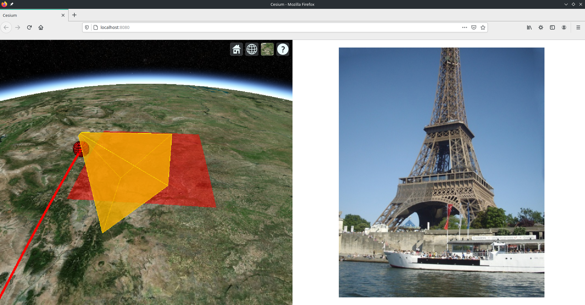

# Thales Mapping Project

## Screenshot


## Instructions
To run, make sure you have node(npm) > 6.0.0 (https://nodejs.org/en/), the most recent one will work well, then open a terminal at the directory and run
```
npm install
``` 
That will install all the required packages, it should show what it's doing in the terminal
```
npm run start
```
This will start a server on localhost::8080, which it should tell you.  Go there in your browser and the Cesium-Typescript app should be running.  At the moment is should zoom/fly to a red sphere, zoom out to see the Earth.  To rotate the view, press middle mouse, there is a help box at the top right with all of what you can do.

This is build in Typescript and Cesium(both open-source).  Typescript is just Javascript with types, which is very helpful for code completion and debugging(it won't even compile if you have used the wrong type).  The best editor to use with Typescript is VSCode, I think, and with it you can hover over varibles to see their types and the options/examples associated with them.

You should only be concerned with the '/src' folder, the rest is just webpack and ts stuff which should work (it was a bit difficult to get ts working with cesium, hence Cesium.d.ts is in the root dir, but hopefully now it all works correctly).  In the src folder, there is html/css/ts, the typescript file 'index.ts' is where cesium loads the map and adds the elements, so it is probably the only one we need to look at, at this stage. 

If you make a modification to any files in src while npm run start is running, the project will automatically be rebuilt and the webpage will be reloaded(Hot reloading), so you can see your changes in real time.

It should be reasonably obvious to see where each part is comming from(that is, the map and the circles, line and polygon) in the index.ts file.


To build the project, run:
```
npm run build
```
but I believe this needs to be served by a server, which can be done relativly easily with python or the npm package 'http-server'.
We might want to consider express for this, just as a simple solution.
