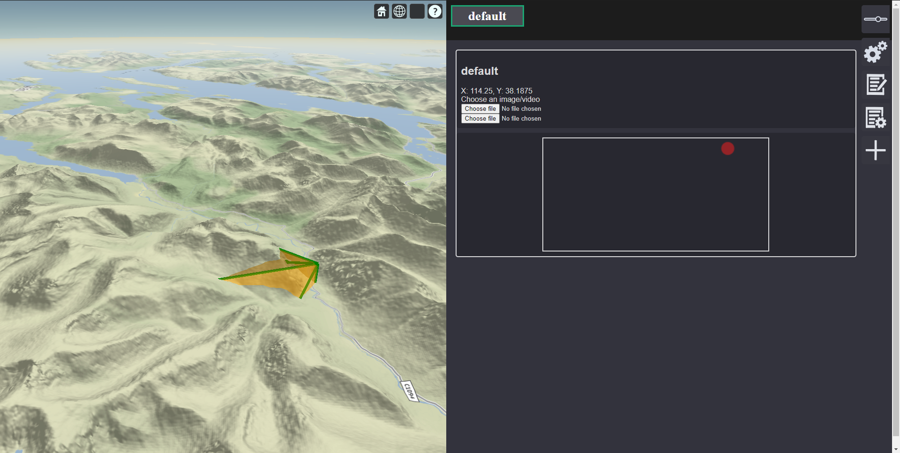

# Thales Mapping Project

---

<div align="center">

</div>
<br/>

<div align="center">

</div>
<br/>

<div align="center">
<a ref="https://stgit.dcs.gla.ac.uk/tp3-2020-CS22/cs22-main-cesium/-/commits/master"></a> &nbsp; 
<a href="https://stgit.dcs.gla.ac.uk/tp3-2020-CS22/cs22-main-cesium/-/commits/master"></a>
&nbsp; 
<a href="https://stgit.dcs.gla.ac.uk/tp3-2020-CS22/cs22-main-cesium/-/commits/master"></a>
</div>
<br/>
<div align="center">

### An application to show and interact with the view frustum of geolocated images or videos on a 3D map.

</div>

## About
CamMap (Name to be decided, this is just what the application is temporarily known as) is an application which allows for the viewing of the view frustum of a video or image with geolocation on a 3D map.  It also maps clicks on the video or image to a real place on the Earth.

## Screenshot
<!---->


## Technologies
##### - Typescript 
##### - Cesium
##### - Karma (for testing)

(All open source)

## Running Instructions
### Prerequisites
To run, make sure you have node(npm) > 6.0.0 (https://nodejs.org/en/), the most recent(LTS) one will work well.  
First install all dependencies by running the following command in project root directory:
```
npm install
```
### Running just the server
To run the project with support for debugging and hot-reloading use:
```
npm run start
```
That starts a server on [localhost:8080](localhost:8080).
### Running with additions
You can also start the main server with supportive services by using provided docker configuration. This will start the fake geodata provider and a terrain server.  
```
npm run full
```
To stop use Ctrl+C and then
```
npm run fullstop
```
### Building locally
This produces a build which must be served by a server (which serves index.html).
```
npm run build
```
This is the base application which can recieve geolocation connections and use 3D terrain servers.  For a 3D terrain server, see [Cesium Terrain Server](https://stgit.dcs.gla.ac.uk/tp3-2020-CS22/cesium-terrain-server).  For the 3D tilesets to serve, see [Terrain Tilesets](https://stgit.dcs.gla.ac.uk/tp3-2020-CS22/terrain-tile-sets).  For geolocation streaming data, see [Test Geodata Providers](https://stgit.dcs.gla.ac.uk/tp3-2020-CS22/test-geodata-providers).
## Using config file
When the server (with or without additions) is running, you can use the config files to simplify loading your camera/location/data presets.
There are two ways of doing so, uploading the .json config file in the app or using the so-called `itty-bitty shorthand`.
### Uploading .json config
To upload json config, when the app is running select the setting tab and then use the `Load Configuration file` option.
### Itty-Bitty shorthand
You can quickly preload your config when starting an app, by putting base64 encoded version of it into the GET request url.
To do that, base64 encode the contents of the json config file and then paste it into the query parameters of the app url.  
Example: `http://localhost:8080/?config=BASE64_ENCODED_STRING`  
Example config files are provided in /example/config folder  
 - 1cam_fixed: just a static camera
 - 1cam_terrain: a static camera with a default [3d terrain server](https://stgit.dcs.gla.ac.uk/tp3-2020-CS22/terrain-tile-sets) (Works with example docker config)
 - 2cam_1geodata: utilises both [3d terrain server](https://stgit.dcs.gla.ac.uk/tp3-2020-CS22/terrain-tile-sets) and [Test Geodata Providers](https://stgit.dcs.gla.ac.uk/tp3-2020-CS22/test-geodata-providers) (Works with debug docker config)
## Deploying
To use production build of the server without having to work with source code, you can use the provided example docker-compose files, to craft your own deployment.  
  
Examples are provided in /example/deployment folder.  
  
In short, to use the docker-compose file you must have have docker installed and running on your system. After that run the following command from the folder containing your config file.
```
docker-compose -f COMPOSE_FILE_NAME up
```
`COMPOSE_FILE_NAME` is the .yml docker-compose file  
To stop and remove the conatiner use
```
docker-compose -f COMPOSE_FILE_NAME down
```
The containers from this project are published at [Dockerhub](https://hub.docker.com/orgs/glacs22/repositories)